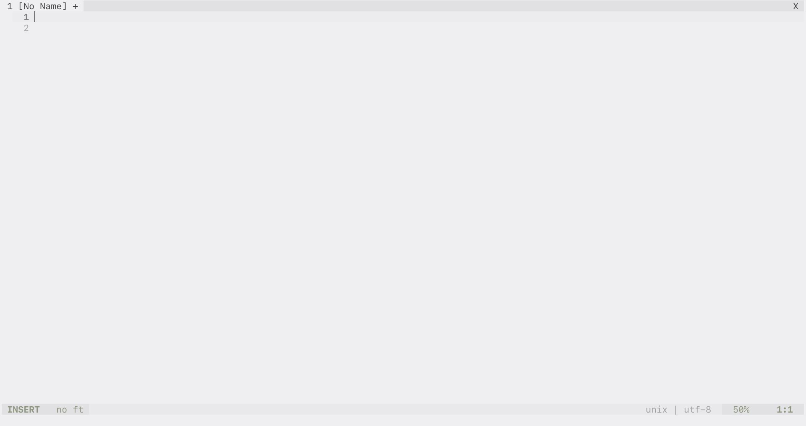
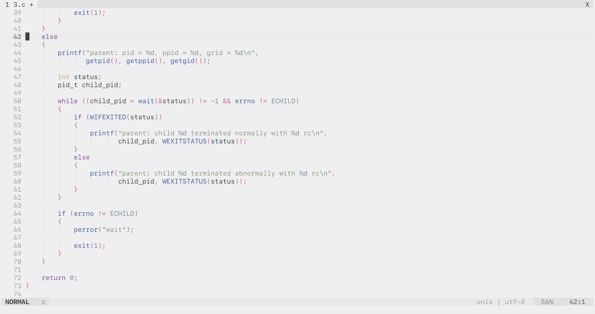
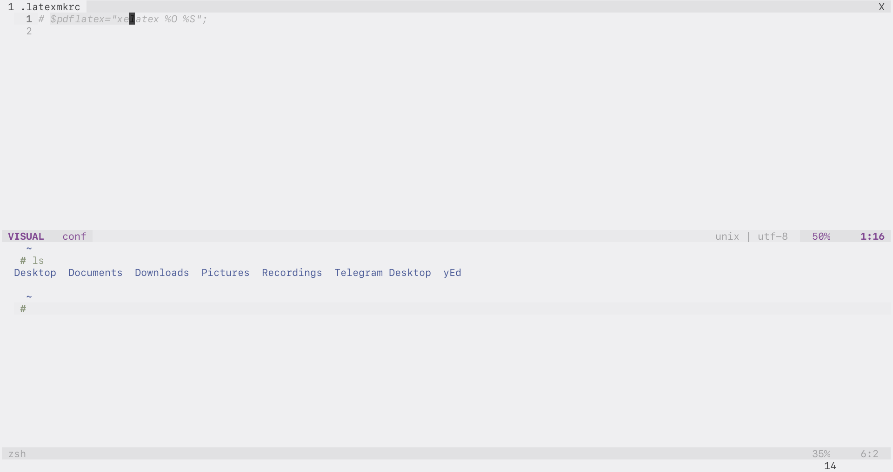

# Homecolors vim theme

plugin code based on `joshdick/onedark.vim` and `cseelus/vim-colors-lucid`

## Examples





## Installation

Use any plugin manager, for example:
```vim
Plugin 'rflban/homecolors.vim'
```

Usage:
```vim
colorscheme home
```

### Lightline
Lightline theme name is `home`.
